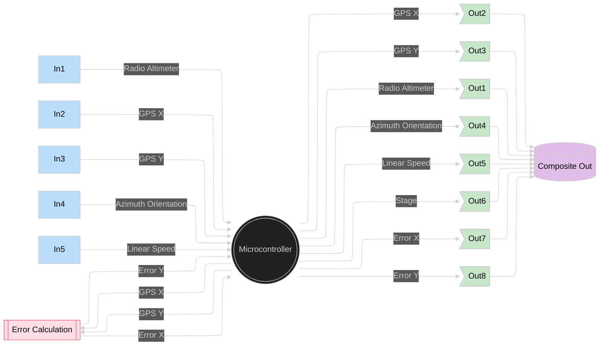

## MAIN CONTROLLER

```mermaid
---
config:
  layout: elk
  theme: dark
---
flowchart LR
    In1["In1"] -- Radio Altimeter --> A((("Microcontroller")))
    In2["In2"] -- GPS X --> A
    In3["In3"] -- GPS Y --> A
    In4["In4"] -- Azimuth Orientation --> A
    In5["In5"] -- Linear Speed --> A
    A -- GPS X --> B[["Error Calculation"]] & Out2>"Out2"]
    A -- GPS Y --> B & Out3>"Out3"]
    B -- Error X --> A
    B -- Error Y --> A
    A -- Radio Altimeter --> Out1>"Out1"]
    A -- Azimuth Orientation --> Out4>"Out4"]
    A -- Linear Speed --> Out5>"Out5"]
    A -- Stage --> Out6>"Out6"]
    A -- Error X --> Out7>"Out7"]
    A -- Error Y --> Out8>"Out8"]
    Out1 --> G[("Composite Out")]
    Out2 --> G
    Out3 --> G
    Out4 --> G
    Out5 --> G
    Out6 --> G
    Out7 --> G
    Out8 --> G

     B:::Rose
    classDef Rose stroke-width:1px, stroke-dasharray:none, stroke:#FF5978, fill:#FFDFE5, color:#8E2236
    style In1 fill:#BBDEFB,color:#000000
    style In2 fill:#BBDEFB,color:#000000
    style In3 fill:#BBDEFB,color:#000000
    style In4 fill:#BBDEFB,color:#000000
    style In5 fill:#BBDEFB,color:#000000
    style B color:#000000
    style Out2 fill:#C8E6C9,color:#000000
    style Out3 fill:#C8E6C9,color:#000000
    style Out1 fill:#C8E6C9,color:#000000
    style Out4 fill:#C8E6C9,color:#000000
    style Out5 fill:#C8E6C9,color:#000000
    style Out6 fill:#C8E6C9,color:#000000
    style Out7 fill:#C8E6C9,color:#000000
    style Out8 fill:#C8E6C9,color:#000000
    style G fill:#E1BEE7,color:#000000
```
